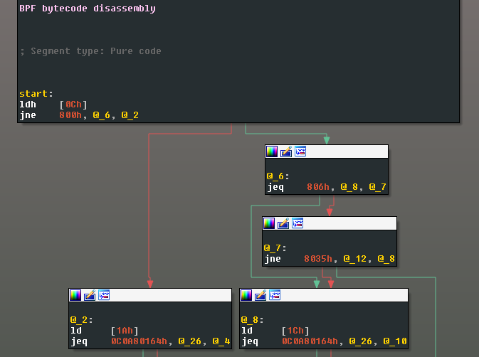

# BPF Bytecode Processor for IDA (python)



## Processor
Supports the old BPF bytecode only (no eBPF). 

The processor will display conditional branches with a 0 value true-offset as their opposite logical counterpart, e.g. `JEQ 0xFF, 0, 1` as `JNE 0xFF, 1, 0`.

## Loader
The loader accepts files that have a custom bpf header and sets up several symbolic constants for seccomp:
```c
SECCOMP_RET_KILL = 0x00000000
SECCOMP_RET_TRAP = 0x00030000
SECCOMP_RET_ERRNO = 0x00050000
SECCOMP_RET_TRACE = 0x7ff00000
SECCOMP_RET_ALLOW = 0x7fff0000
// --------------
AUDIT_ARCH_I386 = 0x40000003
AUDIT_ARCH_X86_64 = 0xC000003E
```
### File Format
The loader accepts files in the following format (see [010template](bpf.bt)):
```c
int magic;
int reserved;
struct sock_filter bpf_c[0];
```
where `magic` must be `"bpf\0"` and `reserved` must be 0. 

## Installation 
put the processor plugin `bpf.py` in:
```xml
<IDA_INSTALL_DIR>\procs\
```
put the file loader `bpf_loader.py` in:
```xml
<IDA_INSTALL_DIR>\loaders\
```

## Supported Versions
- IDA 6.9


## License
[MIT](https://opensource.org/licenses/MIT) 2017 [@bnbdr](https://github.com/bnbdr/)

## Relevant References
- https://www.hex-rays.com/products/ida/support/idapython_docs/
- https://www.hex-rays.com/products/ida/support/sdkdoc/
- http://www.tcpdump.org/papers/bpf-usenix93.pdf
- https://www.kernel.org/doc/Documentation/networking/filter.txt
- http://man7.org/linux/man-pages/man2/seccomp.2.html
- https://github.com/seccomp/libseccomp/blob/master/tools/scmp_bpf_disasm.c
- https://github.com/ghTemp123/wiresharkplugin/blob/master/Scripts/Libnids-119_With_managedLibnids/Libnids-1.19/WIN32-Includes/NET/Bpf.h
